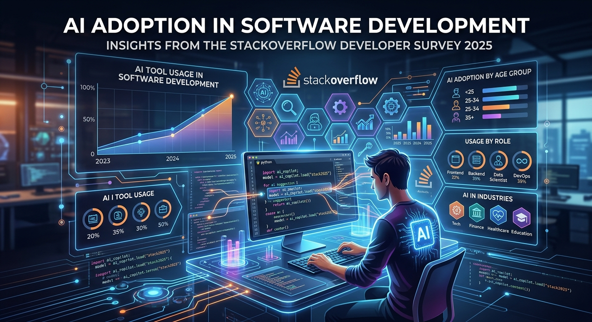
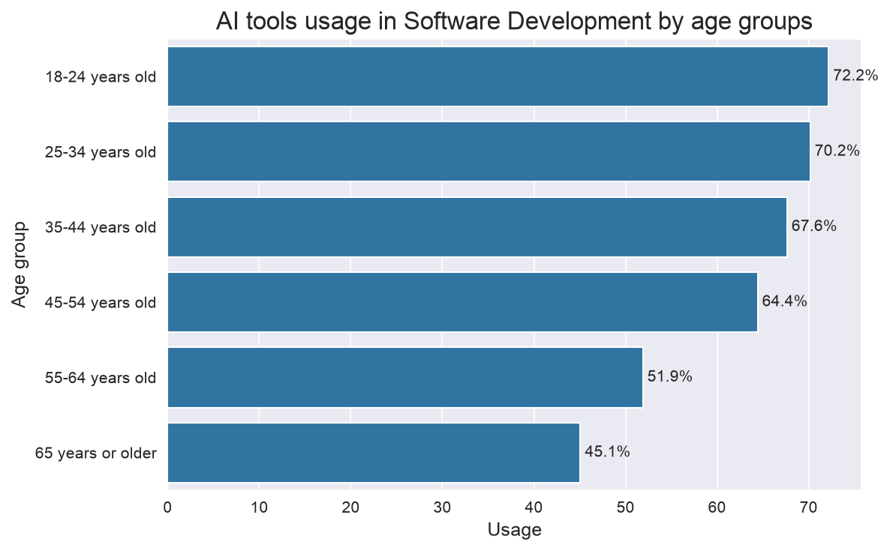
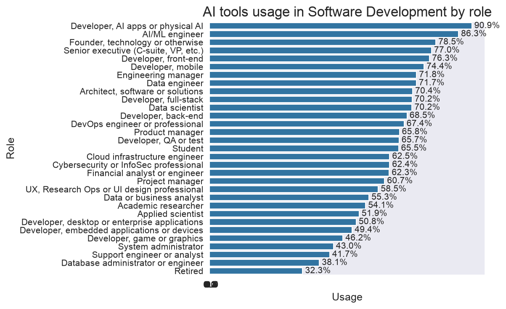
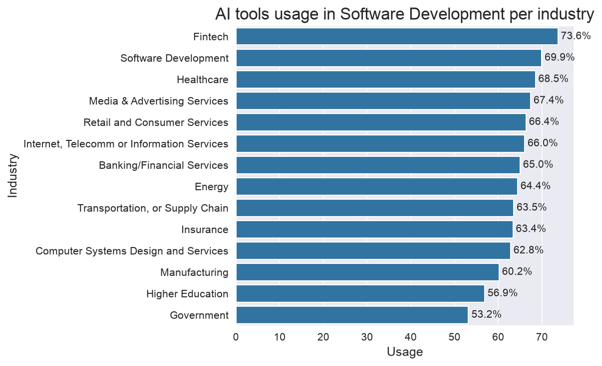
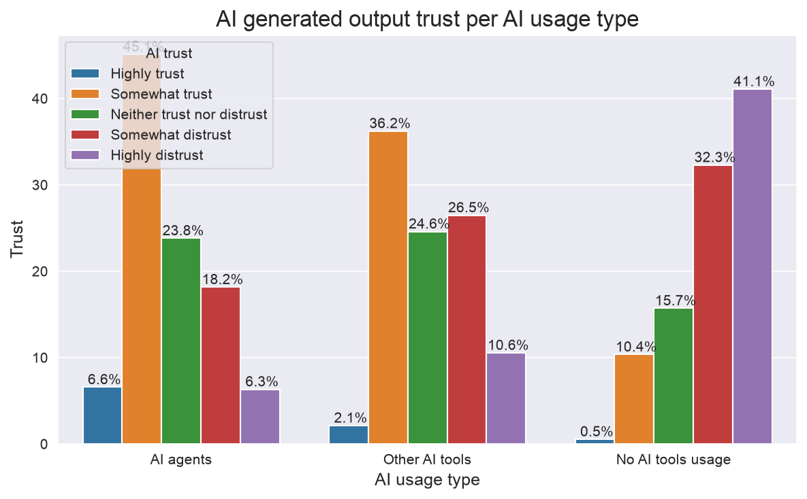

# Introduction

The presence of Artificial Intelligence in our everyday life has dramatically changed since the launch of ChatGPT in December 2022.
Since then AI products were dramatically evolved. Nowadays, Large Language models are capable of generating any content, from simple blog posts and images to audio and video. 

What about Software Development? Are AI tools used widely to generate code? Let's find out.

# Who actually uses AI tools in Software Development?

In order to answer that question I decided to analyse survey responses from [the StackOverflow Developer Survey 2025](https://survey.stackoverflow.com) and find some interesting patterns. I investigated AI tools usage within:
* different age groups, 
* different roles in Software Development 
* industries

## AI tools usage in different age groups

From above chart we can see that the highest level of AI adoption is observed within the youngest groups (it's 72%), while the lowest level of adoption is in the oldest group (above 45%). 
Clearly, there is a trend: the younger the group, the higher use of AI within that group. 

Why do you think that happens? Are younger professionalists more eager to explore new technologies? Or simply, they find work with AI more exciting? What about more experienced specialist? Why in their case level of AI adoption is on that level? Do they trust more their skills they gained over the years? 

## AI tools usage in different roles

What a surprise? This chart clearly shows that AI adoption can vary significantly depending on the role.
AI adoption is the highest among Software Developers working on AI-related solutions (almost 90% of them apply actively AI in their day-to-day work). 
The next group includes Senior Executives, Web and Mobile Application Developers, Data Engineers and Scientist and Software Architects. AI use exceeds 70% in each of these roles. 
In the next group we can find people not working directly with code, like: DevOps Engineers, Product Managers, QA Engineers, Cloud Infrastructure and Cybersecurity experts, Analysts and UX professional. In this case AI adoption level exceeds 60% across these professions.
Next, we have Academic Researchers and Applied Researchers, Desktop, Embedded Application and Game Developers.
At the end of this ranking, there are Operations with result around 40%.

Why do we have almost 50% difference? What drives people to adopt (or not) AI tools in their day-to-day work? 
Are there any aspects that enables (or disable) them to apply AI tools depending on role?

## AI tools usage in different industries

Interestingly, the highest AI tools adoption is in **Fintechs** (73%). 
In the next group (in which AI tools usage is above 60%) we can find: Software Development, Healthcare, Media, Retail, Telecommunication, Banking, Energy Transportation, Insurance and Manufacturing.
At the end of ranking, there are Higher Education and Government.

# Do we trust AI?

At the end, let's have a look into trust of people working in Software Development in AI-generated output.
I've broken that down into type of AI usage:
* AI agents - autonomous systems where larger tasks are delegated to AI 
* Other AI tools - AI tools are used to support human work, where person is still primarily responsible for solving problems
* No AI tools usage - work is fully done by human and no AI tools are used.

We can clearly see that the more responsibility delegated to AI, the higher trust in AI-generated output. 
In case of respondents using AI agents, the trust is over 50%, while 24% members of that group distrust AI.
Those, who use AI to only support their day-to-day work, show lower confidence in AI-generated output: 28% of them at least somewhat trust and 37% somewhat distrust.
Group of people who don't actively use AI, shows the highest distrust: 73% of them say that don't trust AI-generated output, while only 11% trust AI.

Clearly, we see that level of AI adoption depends on the level of trust. Or maybe it's the other way around: people don't trust AI, because they don't use it?

# Summary
The analysis indicates that AI adoption is quite diverse. Younger specialists are more likely to use AI than their older colleagues.
Professional roles and industry are other factors that differentiate AI adoption.
The most interesting finding is that people who use AI more extensively also tend to show a higher level of trust in AI-generated output. 

